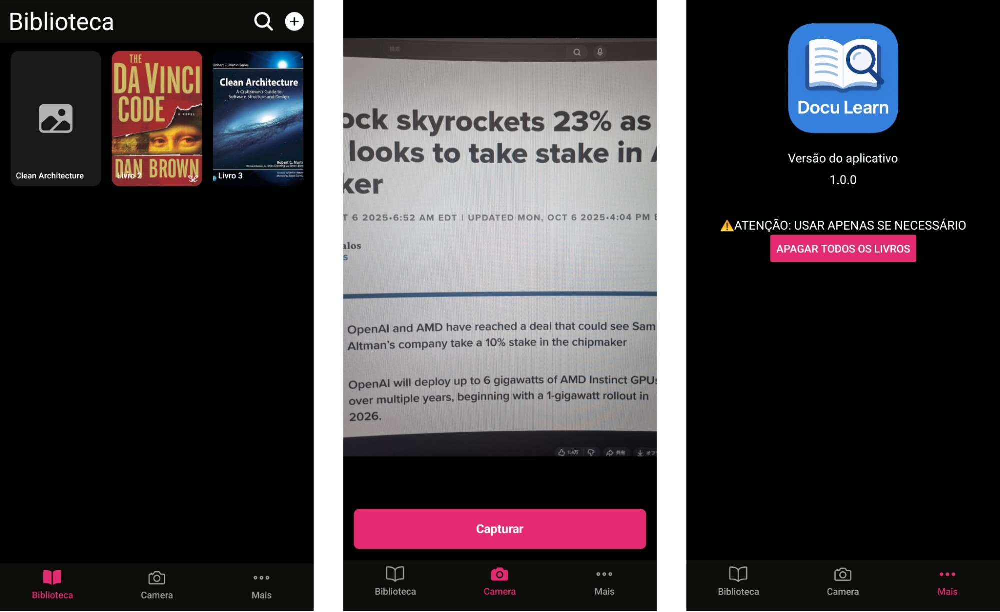
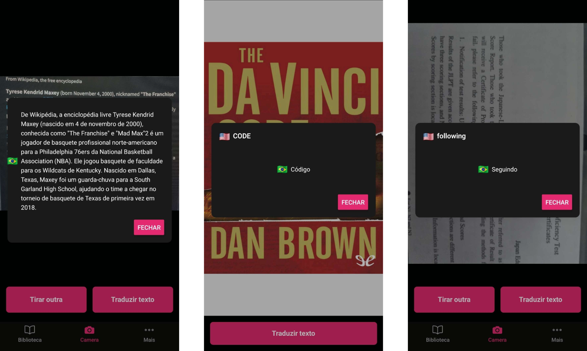

<p align="center"></p>

**DocuLearn** is an intelligent mobile app built with **Expo + React Native** that allows users to read documents, tap on words, and instantly translate them between **English 🇺🇸 → Portuguese 🇧🇷** using an integrated AI-powered translation API.

<ul id="content-table" align="left">
   <li><a href="#features">Features</a></li>
   <li><a href="#technologies">Technologies</a></li>
   <li><a href="#how-to-run">How to run</a></li>
   <li><a href="#screenshots">Screenshots</a></li>
</ul>

<h2 id="features" align="left">🧠 Features</h2>

- 📖 **Document reader:** Upload and read PDF books directly within the app.
- 🔍 **Instant translation:** Tap on any word to get its translation from English → Portuguese.
- 💾 **Local storage:** Books are saved locally using Expo FileSystem, inside the app folder.
- 🗂️ **Book management:** Add and view books easily.
- 🤖 **AI translation API:** Connects to a FastAPI-based Python backend that serves a PyTorch translation model.
- 🎨 **UI:** Built with default dark theming, icons, and a minimalist interface.

<h2 id="technologies" align="left">⚙️ Technologies</h2>

**Mobile App (Frontend)**

- **Expo + React Native:** Cross-platform mobile development framework.
- **@react-native-ml-kit:** OCR library for text extraction w/ Google ML Kit.

**API (Backend)**

- **FastAPI:** Lightweight REST API to serve translation results.
- **HuggingFace + PyTorch:** Deep learning model for text translation.
- **NumPy + Pandas:** Data processing and numerical operations.

<h2 id="how-to-run" align="left">▶️ How to run</h2>

### 🧩 Prerequisites

- [Node.js](https://nodejs.org/)
- [Expo CLI (With dev build)](https://docs.expo.dev/get-started/installation/)
- [Python 3.10](https://www.python.org/downloads/)

### 🚀 Run the App

This project uses **React Native with native dependencies**, so it **cannot be run with Expo Go**.  
You’ll need to build a **development client** or run it directly through **Metro with native builds**.

#### 1. Install dependencies

```bash
npm install
# or
yarn install
```

#### 2. Prebuild the native project

```bash
npx expo prebuild
```

#### 3. Start the Metro bundler

```bash
npx expo start --dev-client
```

> 💡 Do **not** use “Run in Expo Go” — it won’t work because Expo Go doesn’t include native dependencies.

#### 4. Run the app on a device or emulator

Choose one of the following:

```bash
# Android
npx expo run:android

# iOS (on macOS)
npx expo run:ios
```

#### 5. (Optional) Create a custom dev build

To make testing easier, you can create and reuse a dev build:

```bash
npx expo run:android --variant release
```

Then, you can open the app manually and connect it to Metro via the QR code printed in the terminal.

### 🧠 Run the Translation API

> 💡 If CUDA is available, the API automatically moves the model to GPU<br>

1. **Install dependencies**

   To install the required pytorch and transformers libraries, follow the instructions at [PyTorch Get Started](https://pytorch.org/get-started/locally/) for your system.

   Then, install the remaining dependencies:

   ```bash
   pip install -r requirements.txt
   ```

2. **Start the API server**

   ```bash
   python main.py
   ```

3. The server will start automatically at:

   ```
   http://127.0.0.1:8000
   ```

4. Once running, the docs will be available at:
   ```
   http://127.0.0.1:8000/docs
   ```

### 🧩 Example Request

**POST** `/translate`

Request JSON

```json
{
  "text": "He is playing there."
}
```

Response JSON

```json
{
  "original_text": "He is playing there.",
  "translated_text": "Ele está brincando lá."
}
```

<h2 id="screenshots" align="left">🖼️ Screenshots</h2>

<p align="center">
  
  
</p>

<h4 align="center">📚 Built with passion to help learning new languages ❤️</h4>
